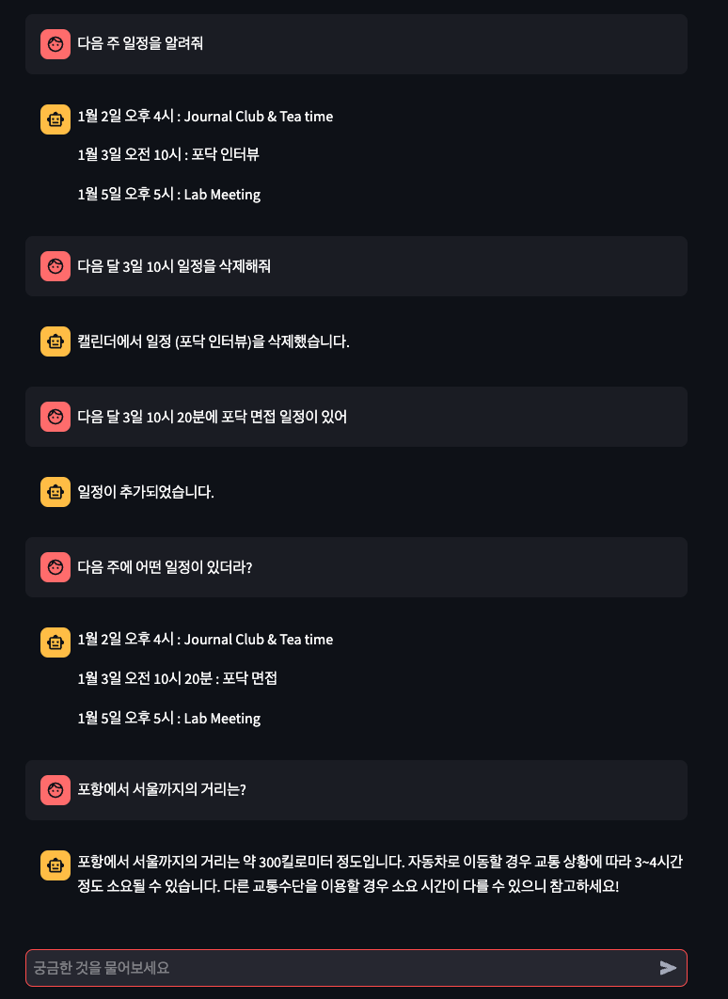

# schedule_manager_chatbot
This is to build a chatbot which manages schedules integrated with Google Calendar using OpenAI API and Google Calendar API. You can create, view, or delete your schedules integrated with your google accounts, just using prompts.

## How to use:
- Enable your Google Calendar API and get `credentials.json` file to save it.
- Execute `get_credentials.py` to get `token.json` file.
- Execute `main.py` using the prompt `streamlit run main.py` in the terminal.
- Enjoy!

## Requirements
- Streamlit
- LangChain
- Google Libraries
- OpenAI or Anthropic

